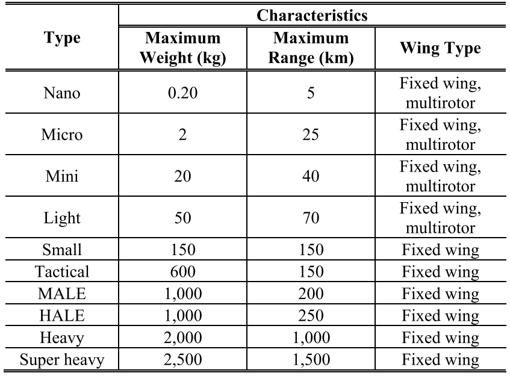

# Drone Scheduling

## Reference Architecture

 - IBM Platform
 - Drones have "Missions"
   - what route a drone should take
   - what it should pickup
   - ...
 - Missions are assigned on L2
 - Data is coming from L1
   - Historical Data for future planning

 - Planes cannot fly over Tibet

 - Latency of 4G is maximum of 200 milliseconds (Sydney-Portugal)
 - 

## Related Work

### The Drone Scheduling Problem: A Systematic State-of-the-Art Review

#### Abbrevations
 - unmanned aerial vehicle (UAV)
 - unmanned aircraft system (UAS)
 - remotely piloted aircraft (RPA)
 - remotely piloted vehicle (RPV)

#### Drone Sizes



#### Papers
 - last-mile delivery 10, 11
    - Prime Air (Amazon) 12, 13
    - Wing (Google) 11, 14
 - literature surveys about drone operations, drone routing, etc. 2, 3, 19-23

# Drone Optimization Problem

This is a simple simulation of drones flying towards a cursor using Pygame.
The simulation includes a `Drone` class with 2D coordinates, velocity, and acceleration vectors, and methods for updating and drawing the drones on the screen.

## Requirements

 - Python 3.x
 - Pygame
 - Numpy

TODO: requirements.txt will follow...

## Usage

Start with:

```
python -m drone.main
```

## MIP Formulation

The optimization of the charging schedule of the drone is done by solving the underlying MIP.
Decision Variables, Objective Function and the Constraints are given below.

### Decision Variables

Let `n` be the number of drones, `m` be the number of packages, and `T` be the total number of time steps in the planning horizon.

1. `c[i][t]`: a binary variable that equals 1 if drone i is charging at time step t, and 0 otherwise.
2. `p[k][t]`: a binary variable that equals 1 if package k is on a drone at time step t, and 0 otherwise.
3. `d[i][j][t]`: a binary variable that equals 1 if drone i is delivering a package to location j at time step t, and 0 otherwise.

### Objective Function

```
minimize sum(i=1 to n, t=1 to T) (1 - c[i][t])
```

### Constraints

 - Each drone can only carry one package at a time.

```
sum(k=1 to m, t=1 to T) p[k][t] <= 1, for all i
```

 - Each package must be picked up at its source location.

```
sum(i=1 to n, t=1 to T) p[k][t] = 1, for all k
```

 - Each package must be delivered to its destination location.

```
sum(i=1 to n, t=1 to T) d[i][j][t] = 1, for all j
```

 - Each drone can only pick up a package if it is at the source location of that package.
```
p[k][t] <= 1 - sum(i!=j, t=1 to T) d[i][source[k]][t], for all k, t
```

 - Each drone can only deliver a package if it is carrying that package.

```
d[i][j][t] <= p[k][t], for all i, j, k, t
```
